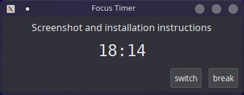

# Focus Timer

Minimal pomodoro-style timer.

## Installation

1. Install pre-requisite libraries for [haskell-gi](https://github.com/haskell-gi/haskell-gi#installation)
2. From the base dir of this repo: `$ cabal install focus-timer`

You'll have to run the executable more or less directly.
